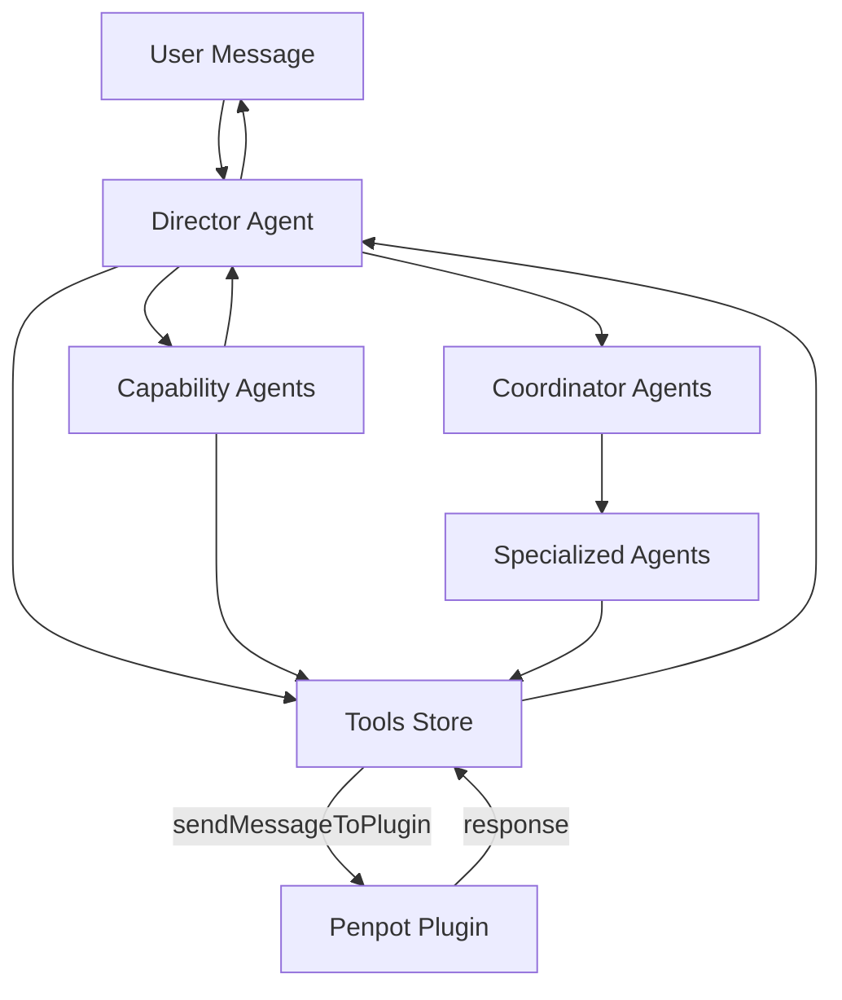

# Architecture

This document describes the multi-agent architecture of Penpot Wizard and how its components interact.

## Three-Layer Architecture

Penpot Wizard runs across three layers:

```
┌─────────────────────────────────────────────────────────────────┐
│                     Penpot Application                           │
│  ┌───────────────────────────────────────────────────────────┐  │
│  │                   Plugin (plugin.js)                       │  │
│  │  - Runs in Penpot context                                  │  │
│  │  - Access to Penpot API (create shapes, get data)          │  │
│  │  - Handlers: mainHandlers.js, drawHandlers/                 │  │
│  └──────────────────────┬────────────────────────────────────┘  │
│                         │ postMessage (bidirectional)            │
│  ┌──────────────────────▼────────────────────────────────────┐  │
│  │              UI (React App in iframe)                       │  │
│  │                                                             │  │
│  │  ┌────────────────────────────────────────────────────┐   │  │
│  │  │           Director Agent / Coordinator               │   │  │
│  │  │  - Main orchestrator                                 │   │  │
│  │  │  - Handles user messages                             │   │  │
│  │  │  - Coordinates tools & specialized agents            │   │  │
│  │  └───┬────────────────────────────────────────────────┘   │  │
│  │      │                                                      │  │
│  │      │ Uses                                                  │  │
│  │  ┌───▼──────────────┬────────────────────────────┐        │  │
│  │  │ Specialized      │ Tools (function, RAG,       │        │  │
│  │  │ Agents           │ drawing, tokens, icons,    │        │  │
│  │  │                  │ image tools)                │        │  │
│  │  └──────────────────┴────────────────────────────┘        │  │
│  └─────────────────────────────────────────────────────────────┘  │
└─────────────────────────────────────────────────────────────────┘

State Management (nanostores):
├── directorAgentsStore        (director agent instances)
├── specializedAgentsStore     (capability + specialized + coordinator agents, wrapped as tools)
├── toolsStore                 (function, RAG, drawing, tokens, icons, image tools)
├── settingsStore              (API keys, models)
├── activeConversationStore    (current conversation state)
├── conversationsMetadataStore (conversation metadata and history)
├── conversationActionsStore   (conversation CRUD actions)
├── streamingMessageStore      (real-time streaming state)
├── userAgentsStore            (user-created agents)
└── penpotStore                (Penpot plugin state)
```

## Agent Types

### Director Agents

- **Purpose**: Top-level orchestrators that handle direct user interaction
- **Location**: `src/assets/directorAgents.js` (legacy directors), `src/assets/agents/penpotWizardAgent.js` (primary entry point)
- **Capabilities**: Use tools (including generate-image, set-image-from-url), call capability agents
- **Combined in**: `src/assets/agents/agents.js` — merges PenpotWizard + legacy directors
- **Examples**: PenpotWizard (default), DesignStudioDirector, TestToolsDirector

### Capability Agents

- **Purpose**: Domain-specific agents that handle focused tasks (design, drawing, planning, prototyping, etc.)
- **Location**: `src/assets/agents/` (one file per agent)
- **Capabilities**: Receive a `query` string, use tools to accomplish the task, return results
- **Agents**:
  - `designer` — Design system creation (colors, typography, spacing)
  - `planner` — Project planning and phased delivery
  - `drawer` — Shape drawing and layout
  - `component-builder` — Component creation from shapes
  - `prototyper` — Prototyping and interactions
  - `illustrator` — Illustrations and icons
  - `modifier` — Shape modifications

### Coordinator Agents

- **Purpose**: Orchestrate complex projects by coordinating specialized agents in sequence
- **Location**: `src/assets/coordinatorAgents.js`
- **Capabilities**: Receive structured briefs via `query`, coordinate specialists, return progress
- **Note**: Initialized together with capability and specialized agents in `specializedAgentsStore.js`
- **Example**: MobileProjectsCoordinator (coordinates planning → design system → UX → drawing)

### Specialized Agents (Legacy)

- **Purpose**: Focused sub-agents for specific domains (UI design, UX, drawing)
- **Location**: `src/assets/specializedAgents.js`
- **Capabilities**: Have inputSchema; can use tools (including image tools)
- **Example**: ui-design-specialist, ux-design-specialist, mobile-view-designer

## Component Interaction Flow

```
1. User sends message     → activeConversationStore
2. Director Agent receives → Processes with AI SDK
3. Agent decides to use   → Calls tools, capability agents, or image tools
4. Tools execute          → May send postMessage to plugin
5. Plugin responds        → Returns data/confirmation to UI
6. Agent generates reply  → Streams back to user
7. UI updates             → Shows streaming response
```

## Data Flow Diagram



## Key Design Decisions

- **postMessage**: Plugin and UI run in separate contexts; all communication is via postMessage
- **Unified tools**: All tools (function, RAG, drawing, tokens, icons) share the same structure: `{ id, name, description, inputSchema, function }`
- **User-created agents**: Directors can be created by users and persisted via `userAgentsStore`
- **Lazy initialization**: Tools and agents initialize when API keys are validated ($isConnected)
