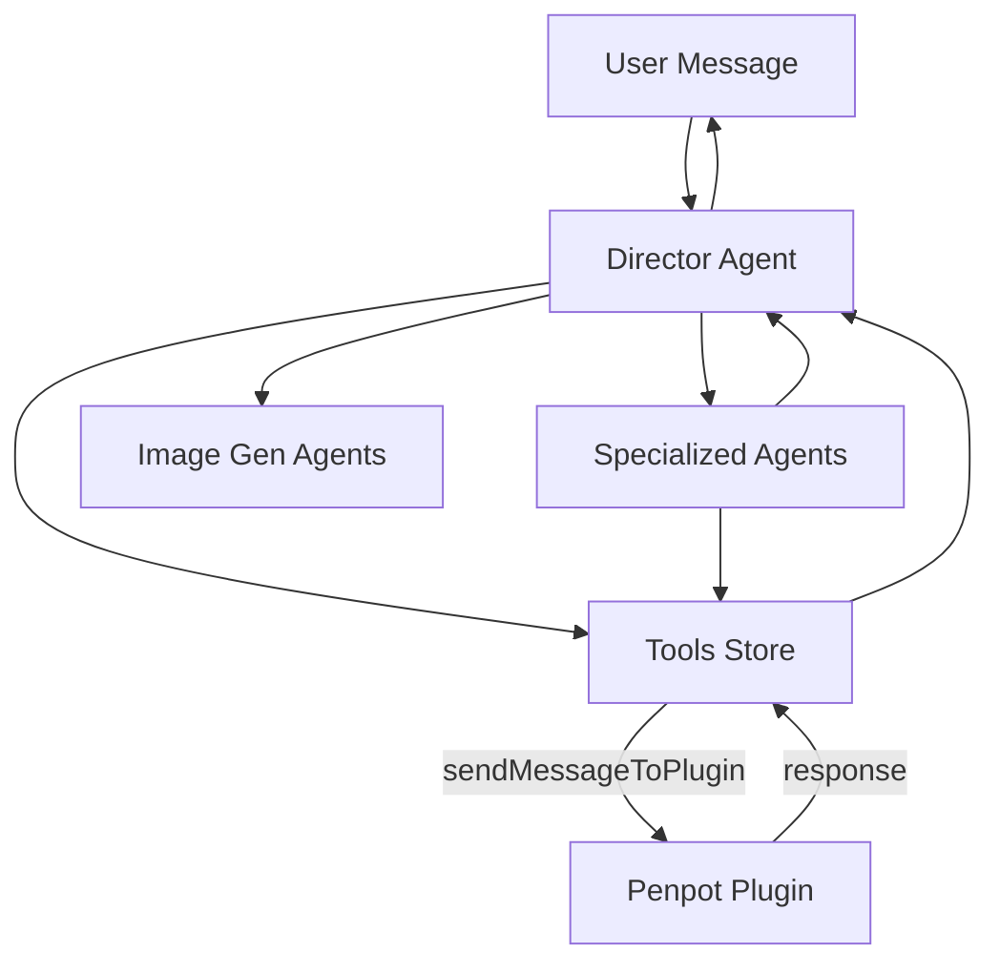

# Architecture

This document describes the multi-agent architecture of Penpot Wizard and how its components interact.

## Three-Layer Architecture

Penpot Wizard runs across three layers:

```
┌─────────────────────────────────────────────────────────────────┐
│                     Penpot Application                           │
│  ┌───────────────────────────────────────────────────────────┐  │
│  │                   Plugin (plugin.js)                       │  │
│  │  - Runs in Penpot context                                  │  │
│  │  - Access to Penpot API (create shapes, get data)          │  │
│  │  - Handlers: mainHandlers.js, drawHandlers/                 │  │
│  └──────────────────────┬────────────────────────────────────┘  │
│                         │ postMessage (bidirectional)            │
│  ┌──────────────────────▼────────────────────────────────────┐  │
│  │              UI (React App in iframe)                       │  │
│  │                                                             │  │
│  │  ┌────────────────────────────────────────────────────┐   │  │
│  │  │           Director Agent / Coordinator               │   │  │
│  │  │  - Main orchestrator                                 │   │  │
│  │  │  - Handles user messages                             │   │  │
│  │  │  - Coordinates tools & specialized agents            │   │  │
│  │  └───┬────────────────────────────────────────────────┘   │  │
│  │      │                                                      │  │
│  │      │ Uses                                                  │  │
│  │  ┌───▼──────────────┬──────────────┬──────────────┐        │  │
│  │  │ Specialized      │ Tools        │ Image         │        │  │
│  │  │ Agents           │ (function,   │ Generation    │        │  │
│  │  │                  │ RAG, drawing,│ Agents        │        │  │
│  │  │                  │ tokens, icons)│               │        │  │
│  │  └──────────────────┴──────────────┴──────────────┘        │  │
│  └─────────────────────────────────────────────────────────────┘  │
└─────────────────────────────────────────────────────────────────┘

State Management (nanostores):
├── directorAgentsStore   (director agent instances)
├── specializedAgentsStore (specialized agents wrapped as tools)
├── coordinatorAgentsStore (coordinator agents)
├── imageGenerationAgentsStore (image generation agents)
├── toolsStore            (function, RAG, drawing, tokens, icons tools)
├── settingsStore         (API keys, models)
├── conversationsStore    (metadata, messages)
└── streamingMessageStore (real-time streaming state)
```

## Agent Types

### Director Agents

- **Purpose**: Top-level orchestrators that handle direct user interaction
- **Location**: `src/assets/directorAgents.js`
- **Capabilities**: Use tools, call specialized agents, call image generation agents
- **Example**: TestToolsDirector, Penpot Wizard

### Coordinator Agents

- **Purpose**: Orchestrate complex projects by coordinating specialized agents in sequence
- **Location**: `src/assets/coordinatorAgents.js`
- **Capabilities**: Receive structured briefs (inputSchema), coordinate specialists, return progress
- **Example**: MobileProjectsCoordinator (coordinates planning → design system → UX → drawing)

### Specialized Agents

- **Purpose**: Focused sub-agents for specific domains (UI design, UX, drawing)
- **Location**: `src/assets/specializedAgents.js`
- **Capabilities**: Have inputSchema, outputSchema; can use tools and image generation agents
- **Example**: ui-design-specialist, ux-design-specialist, mobile-view-designer

### Image Generation Agents

- **Purpose**: Generate images from text prompts and return imageId for use in shapes
- **Location**: `src/assets/imageGenerationAgents.js`
- **Capabilities**: Create images, add to Penpot project, return imageId as backgroundImage
- **Example**: image-generator

## Component Interaction Flow

```
1. User sends message     → activeConversationStore
2. Director Agent receives → Processes with AI SDK
3. Agent decides to use   → Calls tools, specialized agents, or image gen
4. Tools execute          → May send postMessage to plugin
5. Plugin responds        → Returns data/confirmation to UI
6. Agent generates reply  → Streams back to user
7. UI updates             → Shows streaming response
```

## Data Flow Diagram



## Key Design Decisions

- **postMessage**: Plugin and UI run in separate contexts; all communication is via postMessage
- **Unified tools**: All tools (function, RAG, drawing, tokens, icons) share the same structure: `{ id, name, description, inputSchema, function }`
- **User-created agents**: Directors can be created by users and persisted via `userAgentsStore`
- **Lazy initialization**: Tools and agents initialize when API keys are validated ($isConnected)
